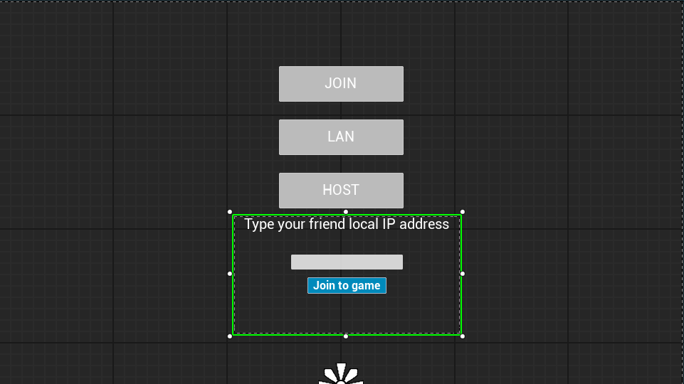
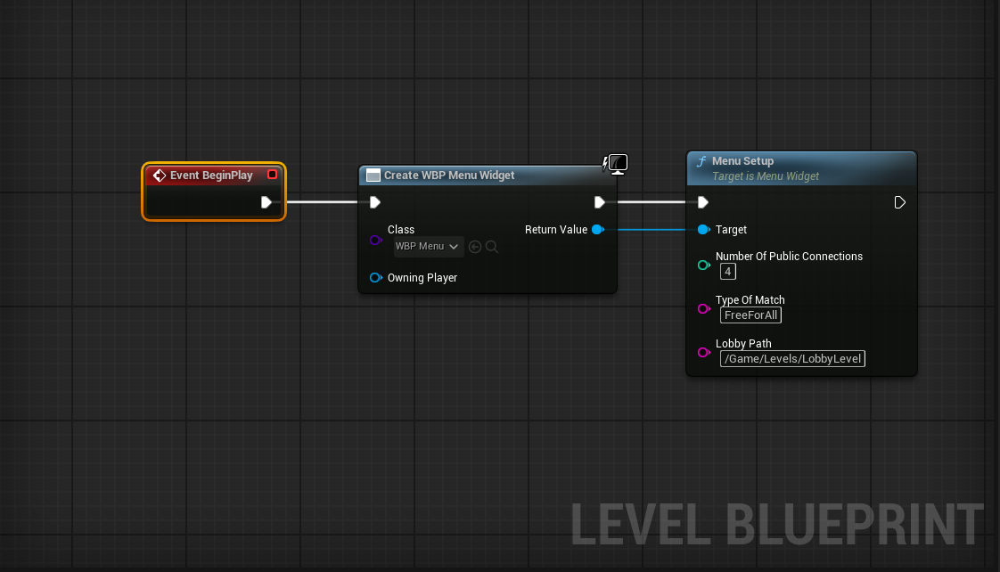

# Multiplayer Sessions Plugin

This project provides a practical example of an online multiplayer menu system in Unreal Engine. It uses a custom `UMultiplayerSessionsSubsystem` to integrate with Unreal’s Online Subsystem (such as Steam) or a LAN-based connection. The plugin detects which subsystem is active—if it’s `"NULL"`, it enables LAN mode. Otherwise, it uses the configured online service (e.g., Steam).

<p align="center">
  
</p>

## Overview

- **MenuWidget**: A `UUserWidget` that provides UI controls (Host, Join, LAN, etc.) and communicates with the subsystem to create, find, or join sessions.
- **MultiplayerSessionsSubsystem**: A `UGameInstanceSubsystem` that handles session functionality—creating, finding, joining, destroying, and starting sessions. It also demonstrates how to handle invites and read a friend list from an online service.

## Features

- **Session Creation and Management**: Easily host, find, join, destroy, and start sessions.
- **Subsystem Detection**: Automatically switches between LAN (NULL) and Online Subsystems (e.g., Steam).
- **Custom Match Types**: Tag sessions with match types (like "FreeForAll") for better filtering and joining.
- **UI Integration**: A sample MenuWidget demonstrates session setup, navigation, and input handling.
- **Invite Support (WIP)**: Early integration of session invites by nickname (requires implementation).

## Installation

1. **Plugin Integration**
   - Copy the `MultiplayerSessions` folder to your Unreal Project's `Plugins` directory:
     ```
     YourProject/Plugins/MultiplayerSessions
     ```

2. **Enable the Plugin**
   - Launch your Unreal Project and go to **Edit > Plugins**.
   - Locate and enable `MultiplayerSessions`.
   - Restart the engine for changes to take effect.

3. **Configure Subsystems**
   - Example `DefaultEngine.ini` setup for Steam:
     ```ini
     [OnlineSubsystem]
     DefaultPlatformService=Steam

     [OnlineSubsystemSteam]
     bEnabled=true
     SteamDevAppId=480
     ```
4. **Subsystem Recognition**  
   The plugin automatically checks the online subsystem name:
   - If `SubsystemName == "NULL"`, the plugin treats sessions as LAN sessions.
   - Otherwise, it proceeds with the configured service (Steam, EOS, etc.).
     
## Usage

**Menu Widget Setup**  
   In your main map or level blueprint, instantiate and add the `MenuWidget` to the viewport. Use its exposed `MenuSetup` function to initialize the session parameters.
   
<p align="center">
  
</p>

### Menu Setup

Use the `UMenuWidget` to handle UI for creating and joining sessions. Example setup in Blueprint:

```cpp
MenuWidget->MenuSetup(4, TEXT("FreeForAll"), TEXT("/Game/Levels/LobbyLevel"));
```

### Invite Friend by Nickname (⚠️ Not Yet Fully Implemented)

This method demonstrates the concept but requires adaptation to your game's friend system:

```cpp
void UMultiplayerSessionsSubsystem::InviteFriendByNickname(const FString& FriendNickname)
{
    if (!SessionInterface.IsValid())
    {
        GEngine->AddOnScreenDebugMessage(-1, 5.f, FColor::Red, TEXT("Session Interface not valid"));
        return;
    }

    TSharedRef<const FUniqueNetId>* FoundId = FriendNameToIdMap.Find(FriendNickname.ToLower());
    if (!FoundId)
    {
        GEngine->AddOnScreenDebugMessage(-1, 5.f, FColor::Red, TEXT("Friend nickname not found!"));
        return;
    }

    SessionInterface->SendSessionInviteToFriend(0, NAME_GameSession, **FoundId);
}
```
The above method attempts to look up a friend’s unique online ID by nickname, then sends an invite through the session interface. Depending on your project’s needs, you may have to customize how friend nicknames are retrieved, stored, or validated.
> ⚠️ **Note**: This function depends on correct nickname mapping and a valid friend list. You must customize this logic based on your actual friend system.

## Compatibility

- Tested with **Unreal Engine 5.4+**
- Compatible with Steam and NULL (LAN) Online Subsystems

## License

Distributed under the MIT License. See `LICENSE` for more information.
