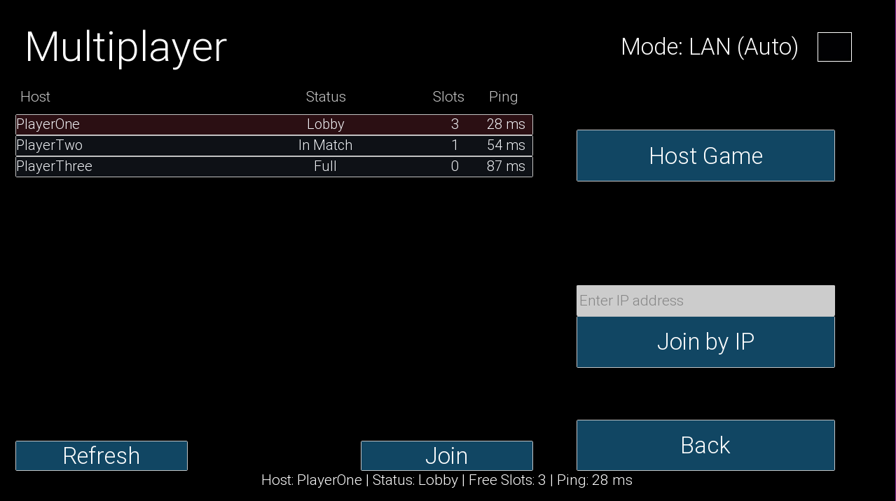
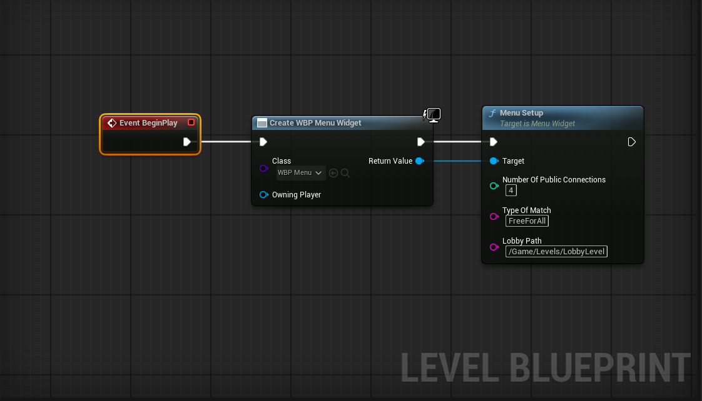

# Multiplayer Sessions Plugin

A compact Unreal Engine 5 C++ plugin for creating, discovering, joining, updating, starting, ending, and destroying multiplayer sessions through Unreal's classic Online Subsystem. It includes a Blueprint-ready session browser, direct-IP travel, Steam lobby sessions, LAN sessions through the NULL subsystem, build compatibility checks, friend invites, operation timeouts, and travel recovery.

<p align="center">
  
</p>

## Overview

* **MultiplayerSessionsSubsystem**: A `UGameInstanceSubsystem` that owns the complete asynchronous session flow and exposes C++ and Blueprint delegates.
* **MultiplayerEntryWidget**: A sample `UUserWidget` for hosting, refreshing, joining selected sessions, LAN mode, and direct-IP connections.
* **Session Browser Widgets**: List item and row classes for displaying session name, host, status, player count, ping, map, and join availability.

## Features

* Create, find, join, leave, update, start, end, and destroy sessions.
* Steam lobby and NULL LAN session settings.
* Search filtering, sorting, cached browser entries, and join-block reasons.
* Automatic local build ID and custom session schema compatibility checks.
* Direct friend invites, platform invite UI, accepted-invite handling, and friend-session joining.
* Direct-IP client travel.
* Busy-state protection, operation timeouts, network/travel failure handling, and recovery cleanup.

## Installation

1. Copy the `MultiplayerSessions` folder into your project's plugin directory:

   ```text
   YourProject/Plugins/MultiplayerSessions
   ```

2. Enable `MultiplayerSessions` and the online provider used by your project, then restart the editor.

3. Configure one default Online Subsystem.

   **NULL for LAN:**

   ```ini
   [OnlineSubsystem]
   DefaultPlatformService=NULL
   ```

   **Steam:**

   ```ini
   [/Script/Engine.GameEngine]
   +NetDriverDefinitions=(DefName="GameNetDriver",DriverClassName="OnlineSubsystemSteam.SteamNetDriver",DriverClassNameFallback="OnlineSubsystemUtils.IpNetDriver")

   [OnlineSubsystem]
   DefaultPlatformService=Steam

   [OnlineSubsystemSteam]
   bEnabled=true
   SteamDevAppId=480

   [/Script/OnlineSubsystemSteam.SteamNetDriver]
   NetConnectionClassName="OnlineSubsystemSteam.SteamNetConnection"
   ```

   `SteamDevAppId=480` is intended for development testing. Use your own Steam App ID before release.

## Usage

Create a Widget Blueprint derived from `UMultiplayerEntryWidget`, add it to the viewport, and initialize it before using the menu:

<p align="center">
  
</p>

The lobby is opened as a listen server after successful session creation. Session searches return `FMultiplayerSessionBrowserEntry` values that can be joined by entry ID or cached result index.

### Invites and Friend Sessions

Invites are available only for non-LAN sessions and depend on support from the active online provider:

```cpp
MultiplayerSessionsSubsystem->ShowPlatformInviteUI();
MultiplayerSessionsSubsystem->SendSessionInviteToFriend(FriendId);
MultiplayerSessionsSubsystem->JoinFriendSession(FriendId);
```

The plugin also listens for accepted session invitations and starts the normal join flow from the received search result. A valid platform user and friend `FUniqueNetIdRepl` are required.

### Direct IP

```cpp
MultiplayerSessionsSubsystem->JoinByAddress(TEXT("127.0.0.1:7777"));
```

Pass a valid Unreal travel address and ensure that the host, net driver, firewall, and port forwarding are configured correctly.

## Compatibility

* Uses Unreal Engine 5 classic Online Subsystem APIs.
* Designed for Steam listen-server lobbies and NULL LAN sessions.
* LAN mode requires an active NULL Online Subsystem; it is not a replacement for a missing subsystem.
* Provider-specific invites, friends, presence, and external UI require testing with real accounts.
* Other online providers and dedicated-server deployments require project-specific validation.

Publish only the Unreal Engine versions and platforms that you have compiled, packaged, and tested.

## License

Distributed under the MIT License. See `LICENSE` for details.
